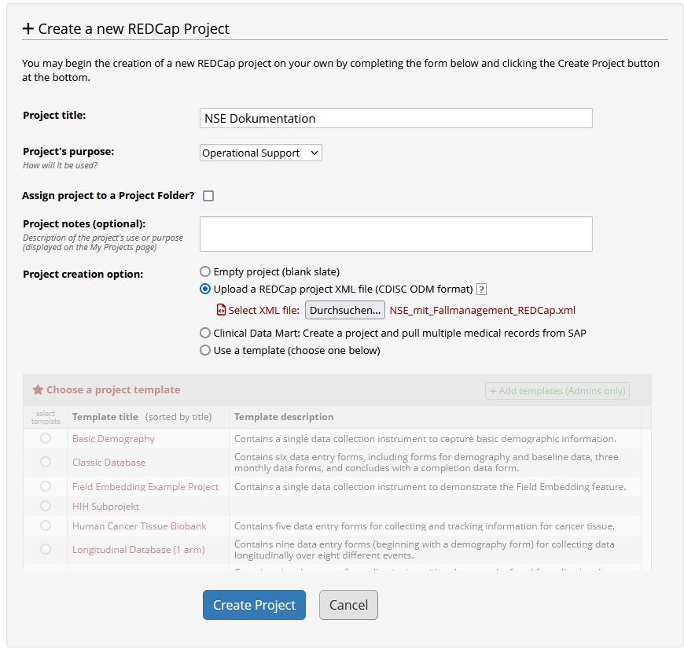
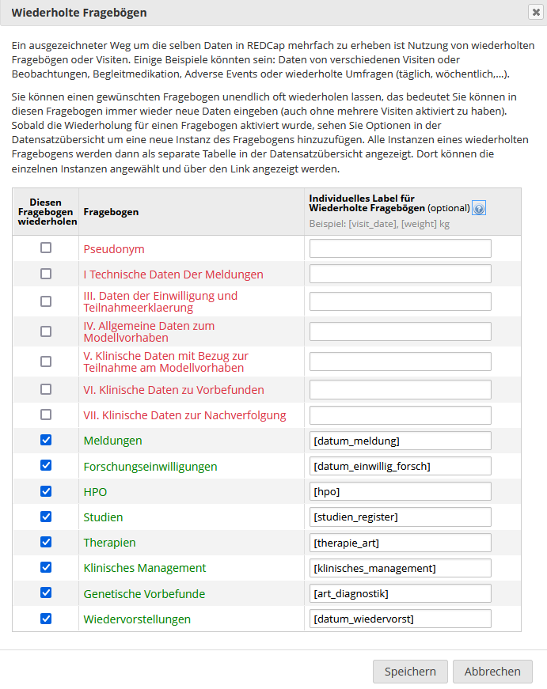
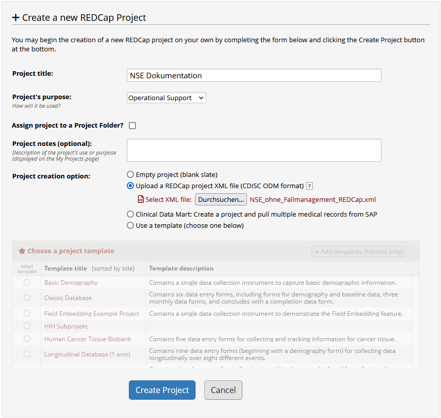
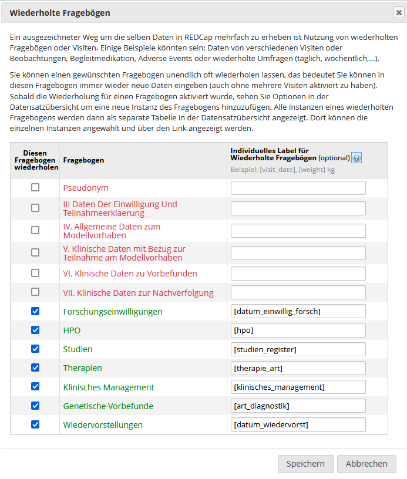
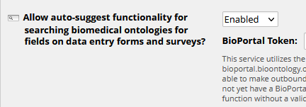
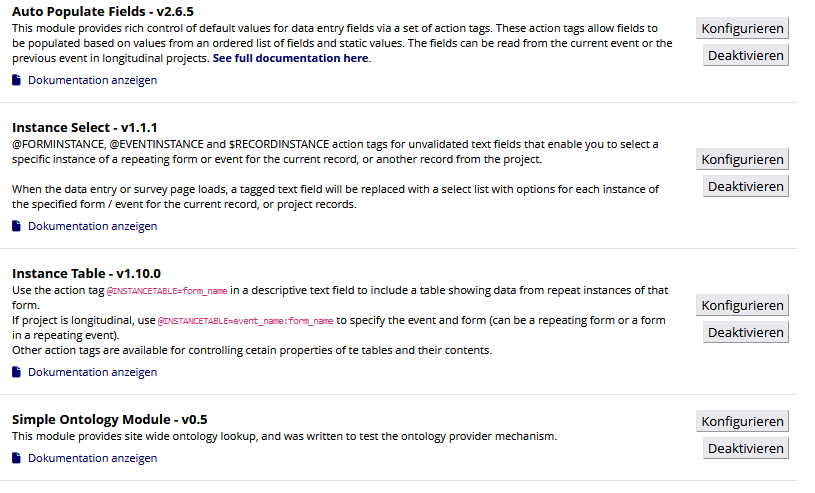

# Klinische Dokumentation für das Netzwerk Seltene Erkrankungen (MV GenomSeq)

Projektvorlage für REDCap zur klinischen Dokumentation des Netzwerks Seltene Erkrankungen (NSE).

## Installation
- Voraussetzung ist eine REDCap Installation. Eine REDCap-Lizenz kann hier beantragt werden: https://projectredcap.org/partners/join/.

Es gibt 2 Varianten des Projekts:
- Dokumentation mit Daten zum Fallmanagement
- Dokumentation ohne Daten zum Fallmanagement: Hier fehlen redundante Felder, die bereits im Fallmanagement-Projekt erfasst werden (Meldungen, Teilnahmeerklärung). Siehe https://github.com/KohlbacherLab/case_management_mvh/
 
### 1a. Anlegen des Projekts "Dokumentation mit Daten zum Fallmanagement"
- Das Projekt inklusive notwendiger Einstellungen kann von einem REDCap Administrator mit der [CDISC ODM XML-Vorlage](NSE_mit_Fallmanagement_REDCap.xml) erstellt werden:

- Alternativ kann ein leeres Projekt erstellt werden und dort die Datenstruktur mit der [CSV Datei](NSE_mit_Fallmanagement_DataDictionary.csv) importiert werden (Strichpunkt als Separator).

Die Projekteinstellungen müssen dann allerdings manuell vorgenommen werden, v.a. die Einstellungen zu den wiederholten Fragebögen:

- Datenstruktur: [PDF Datei](NSE_mit_Fallmanagement_REDCap.pdf)

### 1b. Anlegen des Projekts "Dokumentation ohne Daten zum Fallmanagement"
- Das Projekt inklusive notwendiger Einstellungen kann von einem REDCap Administrator mit der [CDISC ODM XML-Vorlage](NSE_ohne_Fallmanagement_REDCap.xml) erstellt werden:

- Alternativ kann ein leeres Projekt erstellt werden und dort die Datenstruktur mit der [CSV Datei](NSE_ohne_Fallmanagement_DataDictionary.csv) importiert werden (Strichpunkt als Separator).

Die Projekteinstellungen müssen dann allerdings manuell vorgenommen werden, v.a. die Einstellungen zu den wiederholten Fragebögen:

- Datenstruktur: [PDF Datei](NSE_ohne_Fallmanagement_REDCap.pdf)

### 2. Aktivieren des Ontologie-Browsers
Zur Eingabe der HPO-Codes etc. muss die Suche in den Ontologien aktiviert werden. Dazu wird der Service im Kontrollcenter -> Modules / Services Configuration aktiviert und ein gültiges Token für die Bioportal API hinterlegt:

### 3. Benötigte Module
Zur einfacheren Bedienung werden externe Module eingesetzt. Diese müssen von einem REDCap Administrator im Kontrollzentrum installiert und im Projekt aktiviert werden:
- Auto Populate Fields: Unterdrückung der Fehlermeldung für versteckte Voragabe-Werte (@DEFAULT Action Tag)
- Instance Select: Auswahl einer Fallnummer für Datenupload
- Instance Table: Eingabe mehrerer Fallnummern pro Patient
- Ansicht der im Projekt aktivierten Module: 

  

